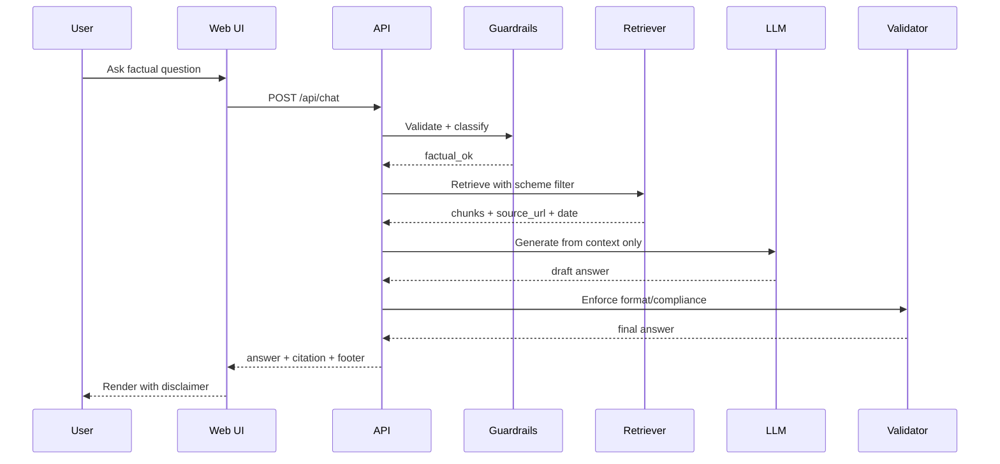
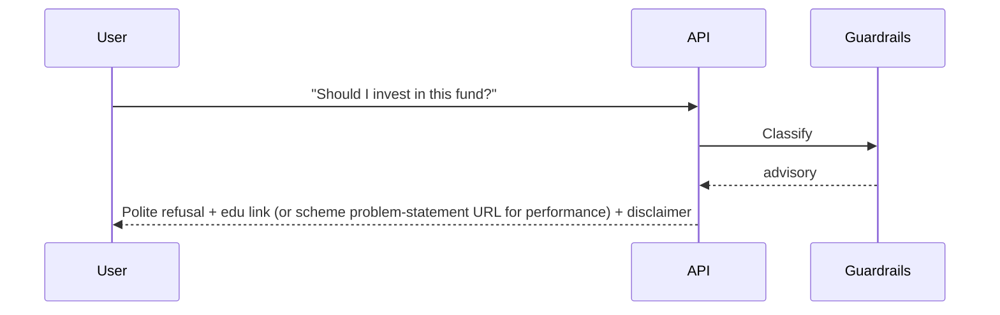

# Architecture: Mutual Fund FAQ Assistant (Facts-Only RAG)

## 1. Purpose

This document defines the system architecture for a **facts-only mutual fund FAQ assistant**, scoped to **Kotak Mahindra AMC** schemes. The product answers objective, verifiable questions by retrieving from a curated corpus built **only** from the mutual-fund source links listed in [`problemStatement.md`](./problemStatement.md), and never provides investment advice, opinions, or recommendations.

Design principles:


| Principle                  | Implication                                                         |
| -------------------------- | ------------------------------------------------------------------- |
| Accuracy over intelligence | Prefer short, cited facts over fluent speculation                   |
| Source exclusivity         | Scheme corpus and answer citations use **only** URLs from `problemStatement.md` (no other hosts or invented links) |
| Compliance by construction | Guardrails refuse advisory and PII-bearing inputs                   |
| Minimal surface area       | Lightweight RAG + simple chat UI; no user accounts or personal data |


---


## 2. Scope Recap


### In scope

- Factual Q&A for 3–5 Kotak schemes chosen from the candidate list in `problemStatement.md`
- Retrieval from pages whose URLs are **exactly** the Reference links in that document (IndMoney scheme pages)
- Strict response format: ≤3 sentences, exactly one citation URL (that scheme’s problem-statement link), last-updated footer
- Refusal of advisory / comparative / performance-calculation queries
- Minimal UI: welcome, 3 example questions, visible disclaimer


### Out of scope

- Portfolio advice, fund ranking, “which is better”
- Ingesting or citing any mutual-fund URL **not** listed in `problemStatement.md` (including AMC / AMFI / SEBI / other aggregator pages as scheme sources)
- Live market data feeds or NAV APIs as answer authorities
- User authentication, account linking, transaction history
- Collecting PAN, Aadhaar, account numbers, OTPs, email, or phone


### Reference product context

Groww-style mutual fund FAQ experience: clear, source-backed, non-advisory.

---


## 3. High-Level Architecture

```text
┌─────────────────────────────────────────────────────────────────┐
│                         Client (Web UI)                          │
│  Welcome · Example questions · Disclaimer · Chat thread          │
└────────────────────────────┬────────────────────────────────────┘
                             │ HTTPS (JSON)
                             ▼
┌─────────────────────────────────────────────────────────────────┐
│                      Application API Layer                       │
│  POST /chat  · health · (optional) /sources metadata             │
└───────┬─────────────────────────────┬───────────────────────────┘
        │                             │
        ▼                             ▼
┌───────────────────┐       ┌───────────────────────┐
│ Input Guardrails  │       │   Query Orchestrator  │
│ · PII detect      │──────▶│   (RAG pipeline)      │
│ · Intent classify │       └───────────┬───────────┘
│ · Advisory refuse │                   │
└───────────────────┘                   │
        │ refuse                        ▼
        │                 ┌─────────────────────────┐
        │                 │ Retriever + Reranker    │
        │                 │ (vector + metadata)     │
        │                 └───────────┬─────────────┘
        │                             ▼
        │                 ┌─────────────────────────┐
        │                 │ Generator (LLM)         │
        │                 │ facts-only prompt       │
        │                 └───────────┬─────────────┘
        │                             ▼
        │                 ┌─────────────────────────┐
        ▼                 │ Output Validator        │
┌───────────────┐         │ · ≤3 sentences          │
│ Refusal path  │◀───────▶│ · exactly 1 citation    │
│ + edu link    │         │ · last-updated footer   │
└───────────────┘         │ · no advice language    │
                          └───────────┬─────────────┘
                                      ▼
                          ┌─────────────────────────┐
                          │ Response to client      │
                          └─────────────────────────┘

Offline / batch path (ingestion):
  problemStatement scheme URLs only  →  Fetch HTML  →  Parse & chunk  →  Embed  →  Vector store + metadata index
```


### Component summary


| Layer               | Responsibility                                                 |
| ------------------- | -------------------------------------------------------------- |
| **UI**              | Chat, disclaimer, example prompts; no personal data fields     |
| **API**             | Stateless chat endpoint; request validation                    |
| **Guardrails**      | Block PII; classify advisory vs factual; early refuse          |
| **Retriever**       | Top-k semantic (+ optional keyword) search over curated chunks |
| **Generator**       | LLM constrained to retrieved context only                      |
| **Validator**       | Enforce response schema and compliance rules                   |
| **Corpus pipeline** | Ingest **only** `problemStatement.md` scheme Reference URLs; attach that URL + effective date |


---


## 4. Logical Components


### 4.1 Presentation layer

**Goal:** Minimal, trustworthy FAQ surface.


| Element              | Behavior                                                       |
| -------------------- | -------------------------------------------------------------- |
| Welcome              | Short intro of facts-only Kotak scheme FAQ                     |
| Example questions    | Three clickable chips (e.g. expense ratio, exit load, min SIP) |
| Disclaimer           | Always visible: `Facts-only. No investment advice.`            |
| Chat                 | User message + assistant reply with citation + footer          |
| Empty / error states | Generic, non-technical messaging; never leak stack traces      |


**Non-goals for UI:** user profiles, saved chats with PII, file upload of KYC docs, comparison widgets.

### 4.2 API / orchestration layer

Recommended surface (implementation may vary):


| Endpoint               | Method | Purpose                              |
| ---------------------- | ------ | ------------------------------------ |
| `/api/chat`            | `POST` | Main Q&A turn                        |
| `/api/health`          | `GET`  | Liveness / readiness                 |
| `/api/meta` (optional) | `GET`  | Schemes covered, corpus refresh date |


`POST /api/chat` **request (conceptual):**

```json
{
  "message": "What is the expense ratio of Kotak Large Cap Fund Direct Growth?",
  "session_id": "optional-opaque-uuid"
}
```

**Response (conceptual):**

```json
{
  "type": "answer" | "refusal",
  "text": "… ≤3 sentences …",
  "citation_url": "https://…",
  "last_updated_from_sources": "YYYY-MM-DD",
  "disclaimer": "Facts-only. No investment advice."
}
```

**Session policy:** Prefer ephemeral, server-side optional history for multi-turn clarification only. Do not persist free-text that may contain PII. Default: **stateless single-turn** RAG for v1.

### 4.3 Input guardrails

Run **before** retrieval to minimize cost and leakage risk.

```text
User message
    │
    ├─▶ PII patterns (PAN, Aadhaar, account #, OTP, email, phone)
    │       └─▶ Refuse: “Please do not share personal or account details…”
    │
    ├─▶ Out-of-corpus / unsupported AMC or scheme
    │       └─▶ Refuse or narrow: list supported Kotak schemes
    │
    └─▶ Intent classifier (rules + small LLM / classifier)
            ├─ factual_scheme_fact     → continue RAG
            ├─ process_howto           → RAG (e.g. statements / capital gains process)
            ├─ performance_request     → refuse advice path; cite that scheme’s problem-statement source URL only
            ├─ advisory_or_compare     → polite refusal + educational link (as allowed in problem statement, e.g. AMFI/SEBI investor education — not a scheme fact citation)
            └─ unclear                 → ask one clarifying question OR refuse if unsafe
```

**Advisory / refuse triggers (non-exhaustive):**

- “Should I invest…”, “Is this good…”, “Which fund is better…”
- Return forecasts, personalized allocation, tax optimization advice
- Requests to compute/compare returns across funds in-product


### 4.4 Retrieval subsystem

**Index contents:** Chunked text from **only** the scheme Reference pages listed in [`problemStatement.md`](./problemStatement.md) (see [§5.4 Chunking strategy](#54-chunking-strategy)), each chunk carrying:


| Metadata field   | Description                                          |
| ---------------- | ---------------------------------------------------- |
| `scheme_id`      | Canonical scheme identifier                          |
| `scheme_name`    | Display name                                         |
| `category`       | e.g. large-cap, liquid                               |
| `doc_type`       | `scheme_reference_page` (IndMoney page from problem statement) |
| `source_url`     | Exact Reference URL from `problemStatement.md` (citation) |
| `effective_date` | Page as-of / ingested content date                   |
| `ingested_at`    | Pipeline run timestamp                               |
| `section`        | Heading / section path (e.g. Fees → Exit Load)       |
| `facet`          | Optional tag: expense_ratio, exit_load, min_sip, …   |
| `parent_id`      | Optional link for parent–child (small-to-big) expand |
| `chunk_id`       | Stable id for idempotent re-ingest                   |


**Retrieval strategy (recommended v1):**

1. **Query normalization** — detect scheme name aliases; map to `scheme_id`.
2. **Hybrid retrieval** — dense embeddings + sparse/BM25 (or metadata filters by scheme).
3. **Top-k** — retrieve k=4–8 chunks; optionally rerank to top 3–4.
4. **Citation selection** — choose **exactly one** primary `source_url`, which must equal the scheme’s Reference URL from `problemStatement.md` (never invent or substitute another host).
5. **Empty retrieval** — do not invent; refuse or say information not in corpus, still pointing only at that scheme’s problem-statement URL if the scheme is in scope.

**Embedding & store (suggested):**

- Embeddings: small/medium sentence embedding model (local or API)
- Vector DB: Chroma / FAISS / pgvector / Qdrant — choose based on deploy target
- Keep corpus small (few schemes × few PDFs) → local FAISS/Chroma is sufficient for MVP


### 4.5 Generation subsystem

**Prompt contract (system)**

- Answer **only** using provided context chunks.
- Maximum **3 sentences**.
- Include **exactly one** citation URL (supplied by orchestrator; model must not invent URLs).
- Append footer: `Last updated from sources: <date>` using chunk `effective_date` (or corpus refresh date if per-doc date unknown).
- If context insufficient → say so; do not guess.
- Never give buy/sell/hold advice or comparative rankings.

**Temperature:** low (e.g. 0–0.2) for determinism.

**Model choice:** **Groq API** for generation (facts-only RAG answers and optional intent assist). Use a Groq-hosted instruct model at low temperature; do not send PII (blocked upstream by guardrails).

### 4.6 Output validator

Post-generation checks (deterministic rules):


| Check                                                       | On failure                                    |
| ----------------------------------------------------------- | --------------------------------------------- |
| Sentence count ≤ 3                                          | Truncate or regenerate once                   |
| Exactly one `https://` citation matching allowlisted domain | Replace with retrieved `source_url` or refuse |
| Footer present with date                                    | Inject from metadata                          |
| Banned phrases (e.g. “you should invest”, “I recommend”)    | Regenerate or refuse                          |
| Citation URL allowlist                                      | Must be an exact scheme Reference URL from `problemStatement.md` |


**Citation allowlist (normative):** copy the full Reference URLs from the scheme table in [`problemStatement.md`](./problemStatement.md). Host expected: `www.indmoney.com`. Do **not** add `kotakmf.com`, `amfiindia.com`, `sebi.gov.in`, or any other mutual-fund page as a scheme answer citation unless that exact URL appears in the problem statement.

### 4.7 Refusal & education path

Refusal responses should:

1. Be polite and explicit about the facts-only limitation
2. Avoid answering the advisory part at all
3. Provide a relevant educational link as described in the problem statement (e.g. AMFI or SEBI investor resource). Educational refusal links are separate from **scheme source citations**, which remain restricted to `problemStatement.md` Reference URLs
4. Still show the product disclaimer

Performance queries: do **not** compute returns; respond with a short refusal of calculation + **the scheme’s problem-statement Reference URL** as the single citation (same URL used for corpus ingest).

---


## 5. Corpus & Ingestion Architecture


### 5.1 Scheme selection (product config)

Select **3–5** schemes from the candidate set in [`problemStatement.md`](./problemStatement.md). **Every** corpus `source_url` and answer citation for a scheme must be the Reference URL from that table — no substitutions.


| Scheme | Category (indicative) | Source URL (from problem statement only) |
| --- | --- | --- |
| Kotak Large Cap Fund – Direct Growth | Large-cap | https://www.indmoney.com/mutual-funds/kotak-large-cap-fund-direct-growth |
| Kotak Midcap Fund – Direct Growth | Mid-cap | https://www.indmoney.com/mutual-funds/kotak-midcap-fund-direct-growth |
| Kotak Arbitrage Fund – Direct Growth | Arbitrage | https://www.indmoney.com/mutual-funds/kotak-arbitrage-fund-direct-growth |
| Kotak Savings Fund – Direct Growth | Debt / savings | https://www.indmoney.com/mutual-funds/kotak-savings-fund-direct-growth |
| Kotak Gold Fund – Growth Direct | Commodity / gold | https://www.indmoney.com/mutual-funds/kotak-gold-fund-growth-direct |
| Kotak Flexicap Fund – Direct Growth | Flexi-cap | https://www.indmoney.com/mutual-funds/kotak-flexicap-fund-direct-growth |
| Kotak Liquid Fund – Growth Direct | Liquid | https://www.indmoney.com/mutual-funds/kotak-liquid-fund-growth-direct |

> **Normative rule:** If a URL is not in `problemStatement.md`, it must not appear in `data/manifest.yaml`, the vector index, or API citations for mutual-fund facts.

### 5.2 Source policy

```text
Mutual fund scheme sources / citations:
  ONLY the Reference links in docs/problemStatement.md
  (copied verbatim into data/manifest.yaml)

Not allowed as scheme corpus or answer citations:
  - AMC / AMFI / SEBI document URLs (unless later added to problemStatement.md)
  - Other aggregators, blogs, social posts, or invented links
```

`data/manifest.yaml` is a mechanical copy of the selected subset of the problem-statement table (scheme name, category, `source_url`). Ingest fetches those pages only.

### 5.3 Ingestion pipeline

```text
┌──────────────┐   ┌─────────────┐   ┌──────────────┐   ┌─────────────┐
│ Source fetch │──▶│ Parse/clean │──▶│ Chunk + tag  │──▶│ Embed+index │
│ (manual or   │   │ PDF/HTML    │   │ metadata     │   │ vector DB   │
│  scheduled)  │   └─────────────┘   └──────────────┘   └─────────────┘
└──────────────┘                                              │
       ▲                                                      ▼
       │                                              ┌───────────────┐
       └──────── corpus manifest (URL, date, hash) ───│ Artifact store│
                                                      └───────────────┘
```

**Pipeline steps:**

1. **Manifest** — YAML/JSON listing selected schemes; `source_url` copied **verbatim** from `problemStatement.md`
2. **Fetch** — download HTML from those URLs only; store raw blob + content hash; reject any URL not on the problem-statement allowlist
3. **Parse** — extract text/tables carefully (expense ratio, exit load often tabular)
4. **Chunk** — apply the strategy in [§5.4 Chunking strategy](#54-chunking-strategy)
5. **Metadata attach** — each chunk’s `source_url` = that scheme’s problem-statement Reference URL; plus `effective_date`, scheme tags
6. **Embed & upsert** — replace prior version of same `doc_id`
7. **Smoke tests** — golden questions per scheme must retrieve correct section

**Refresh cadence:** Manual or weekly batch is enough for MVP. Re-fetch the same problem-statement URLs only. Surface `Last updated from sources` from the newest ingest / page date used in the answer.

### 5.4 Chunking strategy

Chunking is the highest-leverage step for factual mutual-fund RAG: FAQ answers (expense ratio, exit load, min SIP, riskometer, benchmark) live in short, labeled sections and tables. The strategy below optimizes for **precise retrieval of one facet**, not long-form summarization.

#### 5.4.1 Goals

| Goal | How chunking supports it |
| --- | --- |
| One facet per hit | Prefer section-bounded chunks so “exit load” does not mix with “benchmark” |
| Citation integrity | Every chunk inherits a single `source_url` + `effective_date` |
| Table fidelity | Keep fee / load / SIP tables intact (or split by row with headers repeated) |
| Low hallucination surface | Small, self-contained chunks; generator sees only relevant context |
| Stable re-ingest | Deterministic `chunk_id` from `doc_id` + section path + ordinal |

#### 5.4.2 Primary approach: section-aware hierarchical chunking

**Do not** use naive fixed-size sliding windows as the primary splitter for scheme reference HTML pages.

```text
Parsed document
    │
    ▼
1. Structure detect
   TOC / heading hierarchy / bold labels / factsheet blocks
    │
    ▼
2. Section segment
   One logical section = candidate unit
   (e.g. "Exit Load", "Expense Ratio", "Minimum Application Amount")
    │
    ▼
3. Size gate
   ├─ within target → emit as one chunk (+ section header prefix)
   ├─ too large     → split by subsection → paragraph → sentence
   └─ too small     → merge with adjacent sibling under same parent heading
    │
    ▼
4. Enrich
   Prepend: scheme_name | doc_type | section_title
   Attach metadata (scheme_id, source_url, effective_date, facet_tags)
    │
    ▼
5. Optional dual index
   Child chunks (embed) + parent section text (return to LLM if needed)
```

**Hierarchy levels (typical scheme reference HTML page):**

1. Document (`SID` / `KIM` / `Factsheet`)
2. Part / chapter (e.g. “Fees and Expenses”)
3. Section / labelled field (e.g. “Exit Load”)
4. Paragraph / table / bullet

Retrieval embeds **level 3–4** units; generation may optionally expand to the **parent section** for a few sentences of surrounding definition (small-to-big / parent-child pattern).

#### 5.4.3 Size, overlap, and separators

| Parameter | MVP default | Rationale |
| --- | --- | --- |
| Target chunk size | **400–700 tokens** | Fits one fee/load/SIP block with header context |
| Hard max | **1024 tokens** | Avoid oversized embedding inputs |
| Hard min | **80 tokens** | Avoid near-empty heading-only noise (merge instead) |
| Overlap | **50–80 tokens** only when forced to split a long section | Preserve sentence continuity; **0 overlap** across different sections |
| Separators (priority order) | Heading → blank line → paragraph → sentence → token | Never split mid-number or mid-table-row |

**Header prefix (required on every chunk text):**

```text
[Scheme: Kotak Large Cap Fund – Direct Growth]
[Doc: Factsheet | Section: Expense Ratio]
<chunk body>
```

This improves embedding recall when the user names the scheme but the local paragraph does not repeat it.

#### 5.4.4 Document-type rules

Corpus pages are the IndMoney scheme Reference URLs from `problemStatement.md` (`doc_type: scheme_reference_page`). Apply HTML section rules:

| Content area | Chunking rule |
| --- | --- |
| **KPI / fee blocks** | Treat labelled fields (expense ratio, exit load, min SIP, riskometer, benchmark, AUM, etc.) as atomic sections. Prefer one chunk per label. |
| **Tables** | One chunk per table if small; else row-chunks with column headers repeated. |
| **Process / howto copy** | If the page covers statements or capital-gains download steps, keep numbered steps in one chunk when under max size. |
| **Unrelated funds / nav chrome** | Strip site chrome; do not index content for schemes outside the selected problem-statement set. |

Do not ingest SID/KIM/factsheet PDFs from other hosts for MVP — scheme sources are limited to problem-statement links.

#### 5.4.5 Table handling (critical for fees & loads)

Mutual-fund facts are often tabular. Rules:

1. **Detect tables** during parse (PDF table extractor or HTML `<table>`).
2. **Serialize** to a stable text form, e.g.:

   ```text
   Expense Ratio | Direct Plan – Growth | 0.xx%
   Exit Load | If redeemed within 1 year | 1%
   ```

3. **Atomic preference:** if the full table ≤ hard max → **one chunk** (best for “what is the exit load?”).
4. **Row split:** if too large → one chunk per row (or per plan variant: Direct vs Regular), **repeating column headers** in every row-chunk.
5. **Never** split a numeric cell across chunks.
6. Optionally also write the same values into the **structured fact side-car** (§5.5) for exact lookup.

#### 5.4.6 Facet tagging at chunk time

During chunking, tag sections with zero or more `facet` labels used later as retrieval filters / boosts:

| Facet tag | Example section cues |
| --- | --- |
| `expense_ratio` | “Total Expense Ratio”, “TER”, “Expense Ratio” |
| `exit_load` | “Exit Load”, “Load Structure” |
| `min_sip` / `min_investment` | “Minimum SIP”, “Minimum Application Amount” |
| `lock_in` | “Lock-in”, “ELSS” |
| `riskometer` | “Product Labelling”, “Riskometer” |
| `benchmark` | “Benchmark Index”, “Scheme Benchmark” |
| `process_statements` | “Account statement”, “capital gains”, “download report” |

If a heading matches a facet, set `section` + `facet` metadata even when body text is short.

#### 5.4.7 Parent–child (optional but recommended)

| Layer | Stored content | Used for |
| --- | --- | --- |
| **Child** | 400–700 token section/paragraph/table slice | Embedding + similarity search |
| **Parent** | Full section under the same heading (up to ~1500 tokens) | Context passed to the LLM after child hit |

Flow: retrieve top child chunks → dedupe by `parent_id` → pass parent text (or child + short parent) to the generator. This recovers definitions that sit one paragraph above a fee table without bloating the vector index.

#### 5.4.8 What not to index (or down-rank)

- Cover chrome, cookie banners, pure marketing carousels unrelated to the scheme fact blocks  
- Content for schemes **not** in the selected problem-statement subset  
- Any page whose URL is not an exact Reference link from `problemStatement.md`  
- Scanned image-only regions without OCR confidence  

Page headers/footers stripped at parse time so they do not become their own chunks.

#### 5.4.9 Chunk identity & idempotent re-ingest

```text
chunk_id = hash(doc_id + section_path + ordinal + content_hash)
```

On re-ingest of the same `doc_id` (updated page content at the same problem-statement URL): delete prior chunks for that `doc_id`, then insert the new set. Update `effective_date` / `ingested_at` on all new chunks.

#### 5.4.10 Quality gates before embed

| Check | Action if failed |
| --- | --- |
| Empty / whitespace-only body | Drop |
| No `source_url` or `scheme_id` | Fail ingest for that doc |
| `source_url` not an exact URL from `problemStatement.md` | Fail ingest for that doc |
| Chunk > hard max after split attempts | Hard-split on sentences; log warning |
| Selected scheme page missing any core facet tags after full ingest | Fail smoke test (block release) |
| Duplicate near-identical chunks (cosine / hash) | Keep one; prefer higher-quality parse of the same problem-statement URL |

#### 5.4.11 Relation to retrieval

- Default retrieve **k = 4–8 child chunks**, metadata-filter by `scheme_id` when scheme is resolved.  
- Optional boost when query intent matches `facet` tag (e.g. expense-ratio question → prefer `facet=expense_ratio`).  
- Citation URL always taken from the winning chunk’s metadata (problem-statement Reference URL), never from model free text.

### 5.5 Supported FAQ facets (index coverage)

Ensure chunks (or structured side-car facts) cover:

- Expense ratio  
- Exit load  
- Minimum SIP / investment amounts  
- Lock-in (e.g. ELSS if included)  
- Riskometer  
- Benchmark index  
- How to download statements / capital gains reports (only if present on the problem-statement scheme pages)

Optional **structured fact table** per scheme can sit beside vectors for high-precision fields (expense ratio, exit load), populated during chunking/table serialization (§5.4.5), with RAG used for prose/process questions. Each structured fact must carry the same problem-statement `source_url`. Hybrid structured + RAG is recommended for reliability.

---


## 6. End-to-End Request Flow


### 6.1 Happy path (factual answer)




### 6.2 Refusal path




---


## 7. Suggested Technology Stack (MVP)

Architecture is stack-agnostic; a practical lightweight stack:


| Concern       | Suggestion                                                                    |
| ------------- | ----------------------------------------------------------------------------- |
| UI            | Next.js or Streamlit / Gradio for fastest demo; React SPA if product-polished |
| API           | FastAPI (Python) or Next.js route handlers                                    |
| Orchestration | LangChain / LlamaIndex **or** thin custom RAG (~200 LOC)                      |
| Embeddings    | `sentence-transformers` or OpenAI/compatible embeddings                       |
| Vector store  | Chroma or FAISS for local; pgvector if already on Postgres                    |
| LLM           | **Groq API** (OpenAI-compatible chat completions); low temperature (0–0.2); model chosen from Groq’s hosted catalog (e.g. Llama / Mixtral-class instruct models) |
| Docs          | `docs/problemStatement.md`, this `architecture.md`, root `README.md`          |
| Config        | `.env` with `GROQ_API_KEY` (and optional `GROQ_MODEL`); scheme manifest in `data/manifest.yaml` |
| Tests         | Golden Q&A set + refusal suite                                                |


**Repository layout (proposed):**

```text
/
├── docs/
│   ├── problemStatement.md
│   └── architecture.md
├── data/
│   ├── manifest.yaml          # scheme + source URLs (from problemStatement.md only)
│   ├── raw/                   # fetched HTML from those URLs
│   └── processed/             # chunks / structured facts
├── src/
│   ├── ingest/                # fetch, parse, chunk, embed
│   ├── rag/                   # retrieve, generate, validate
│   ├── guardrails/            # PII, intent, problem-statement URL allowlist
│   └── api/                   # HTTP handlers
├── ui/                        # chat frontend
├── tests/
│   ├── golden_questions.json
│   └── refusal_cases.json
└── README.md
```

---


## 8. Data, Privacy & Security


| Requirement                                       | Architectural control                                                               |
| ------------------------------------------------- | ----------------------------------------------------------------------------------- |
| No PAN / Aadhaar / accounts / OTP / email / phone | Regex + heuristic PII gate; drop message; no logging of raw message if PII detected |
| No investment advice                              | Intent gate + output phrase banlist + validator                                     |
| Scheme sources only from problem statement        | Ingest + citation allowlist = exact Reference URLs in `problemStatement.md`         |
| Transparency                                      | Mandatory citation + last-updated footer                                            |
| Minimal retention                                 | Stateless chat by default; logs: hashes/metrics only, not PII                       |


**Logging policy:** Log request id, latency, intent label, retrieval hit/miss, validator pass/fail — not full user text unless scrubbed and needed for debugging in a private env.

---


## 9. Response Contract (Normative)

Every **answer** response must satisfy:

1. **Body:** at most 3 sentences, factual, grounded in retrieved context
2. **Citation:** exactly one URL, which must be that scheme’s Reference link from `problemStatement.md`
3. **Footer:** `Last updated from sources: <YYYY-MM-DD>`
4. **Product disclaimer** visible in UI (and optionally echoed in API)

Every **refusal** response must satisfy:

1. Polite facts-only limitation statement
2. No partial advice
3. One educational link (per problem statement examples) **or**, for performance refusals, the scheme’s problem-statement Reference URL
4. Same UI disclaimer

---


## 10. Quality, Evaluation & Success Mapping


| Success criterion (problem statement) | Architectural measure                                   |
| ------------------------------------- | ------------------------------------------------------- |
| Accurate factual retrieval            | Golden set per scheme/facet; retrieval hit-rate metrics |
| Facts-only adherence                  | Refusal suite; offline eval of advisory prompts         |
| Valid source citations                | Citation equals problem-statement Reference URL only    |
| Proper advisory refusal               | Intent classifier tests                                 |
| Clean minimal UI                      | Checklist: welcome, 3 examples, always-on disclaimer    |


**Golden evaluation categories:** expense ratio, exit load, min SIP, riskometer, benchmark, process (statements), advisory refuse, performance-link-only, PII refuse.

---


## 11. Deployment View

```text
┌────────────────────┐     ┌─────────────────────┐
│ Static / SSR UI    │────▶│ API (container)     │
└────────────────────┘     │  + guardrails       │
                           │  + RAG + LLM client │
                           └──────────┬──────────┘
                                      │
                    ┌─────────────────┼─────────────────┐
                    ▼                 ▼                 ▼
             Vector index      LLM provider      Object/blob
             (volume/local)    (API key)         (raw PDFs)
```

**MVP:** single machine or single container with baked/local index.  
**Later:** separate ingest job (CI or cron), versioned index artifacts, config-driven scheme expansion.

---


## 12. Risks & Mitigations


| Risk                        | Mitigation                                                                   |
| --------------------------- | ---------------------------------------------------------------------------- |
| Stale page numbers              | Show last-updated date; re-fetch same problem-statement URLs; prefer structured facts with dates |
| LLM hallucination               | Grounding-only prompt; refuse on empty retrieval; validator                                      |
| Wrong scheme attribution        | Scheme entity linking + metadata filter before retrieve                                          |
| HTML/table extraction errors    | Manual structured overrides for critical fields                                                  |
| User pushes for advice          | Hard refusal path; no soft hedging recommendations                                               |
| Citation to wrong / extra URL   | Citation = chunk metadata URL from problem-statement allowlist only; never model-generated       |


---


## 13. Known Limitations (Architectural)

- Corpus covers a **small fixed set** of Kotak schemes from `problemStatement.md`, not the full AMC catalog  
- Answers are only as current as the last successful re-fetch of those Reference URLs  
- Process questions (statements, capital gains) depend on whether that content exists on the problem-statement scheme pages  
- No personalized tax, risk-profile, or portfolio analysis by design  
- Multi-turn context is intentionally weak/absent in v1 to reduce PII retention risk  
- Scheme citations are limited to IndMoney Reference links in the problem statement (no alternate AMC/AMFI/SEBI scheme URLs in MVP)

---


## 14. Implementation Phases


| Phase               | Deliverable                                                             |
| ------------------- | ----------------------------------------------------------------------- |
| **P0 – Corpus**     | Manifest from `problemStatement.md` URLs only; 3–5 schemes; structured critical fields |
| **P1 – RAG core**   | Retrieve + generate + validator; golden Q&A CLI                                         |
| **P2 – Guardrails** | PII + advisory refusal + performance → scheme problem-statement URL                     |
| **P3 – UI**         | Welcome, examples, disclaimer, chat                                                     |
| **P4 – Harden**     | Eval suite, README, refresh runbook                                                     |


---


## 15. Alignment Checklist

- [x] Facts-only FAQ for mutual funds (Kotak)  
- [x] Scheme sources / citations **only** from Reference URLs in `problemStatement.md`  
- [x] RAG with curated corpus  
- [x] ≤3 sentences, one citation, last-updated footer  
- [x] Advisory refusal + educational link  
- [x] Minimal UI with disclaimer  
- [x] No collection of sensitive personal identifiers  
- [x] No performance calculation / comparative advice in-product  

---


## Document control


| Item     | Value                                          |
| -------- | ---------------------------------------------- |
| Related  | `[problemStatement.md](./problemStatement.md)` |
| Status   | Draft architecture for implementation          |
| Audience | Engineering, PM, compliance review             |


